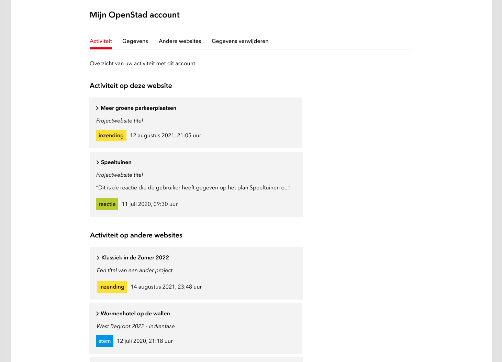
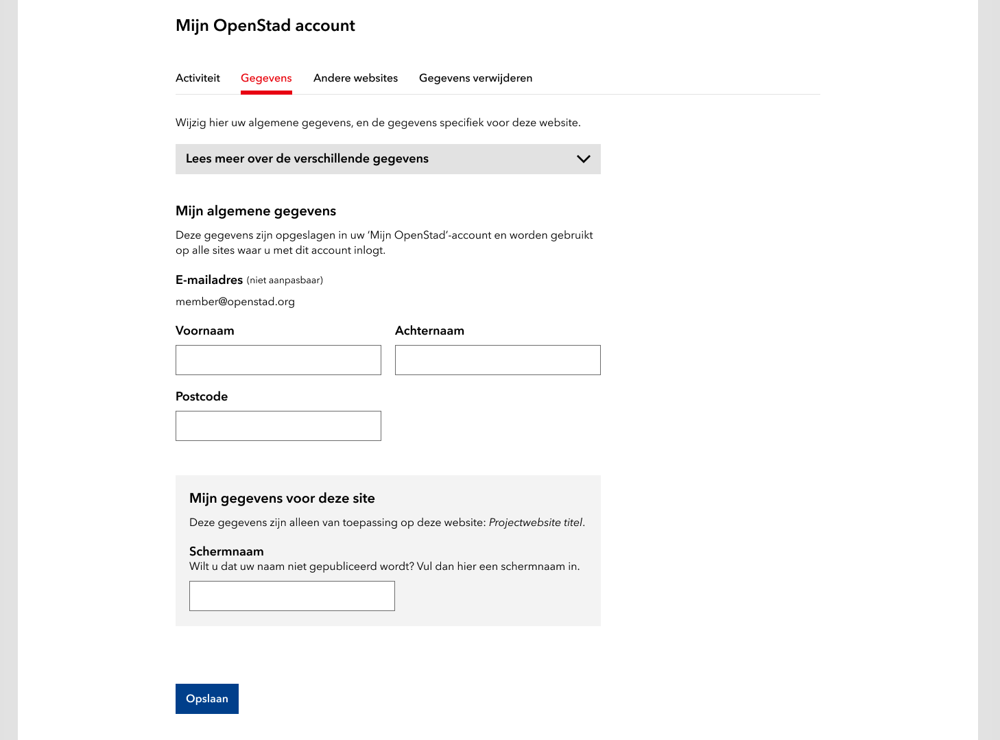

# Gebruikersbeheer


Dit artikel behandeld functionaliteiten die aan gebruikers zelf aangeboden kunnen worden. Er is daarnaast ook functionaliteit voor moderators/admins, om alle gebruikers van een website te anonimiseren. Zie daarvoor dit artikel:[gebruikers-anonimiseren-per-website.md](gebruikers-anonimiseren-per-website.md "mention").


## Verschillende functionaliteiten

'Gebruikersbeheer' is een breed begrip, waar onderstaande functionaliteiten onder worden verstaan.

### Activiteit

Het activiteitenoverzicht laat de activiteiten zien die met het ingelogde account gedaan zijn. Ook de activiteiten op andere websites, maar met hetzelfde account, worden getoond. De activiteiten die in dit overzicht getoond worden, zijn:

* inzendingen die gedaan zijn
* reacties die bij inzendingen geplaatst zijn
* stemmen die op inzendingen uitgebracht zijn

### Gegevens

Gebruikers kunnen hun gegevens aanpassen met een formulier. Optioneel kan per website voor gebruikers de mogelijkheid geactiveerd worden om een schermnaam (of _alias_) in te voeren, als een gebruiker niet onder diens eigen naam op een website actief wil zijn. Deze mogelijkheid kan ingeschekeld worden in het (beta) adminpanel: [adminpanel-beta.md](../miscellaneous/adminpanel-beta.md "mention").

### Andere websites

Het 'Andere sites'-overzicht toont de andere websites waar de gebruiker met het ingelogde account actief is geweest.

### Gegevens verwijderen

Gebruikers hebben de mogelijkheid om alleen voor specifieke projecten hun gegevens te verwijderen. Dit heeft wel gevolgen voor:

* **Inzendingen** - Inzendingen die de gebruiker heeft gedaan blijven bewaard en op de website staan, maar niet meer onder de naam van de gebruiker. Het zal voor de gebruiker niet meer mogelijk om de inzendingen te bewerken of te verwijderen.
* **Argumenten en reacties** - Argumenten en/of reacties die de gebruiker heeft geplaatst blijven bewaard en op de website staan, maar niet meer onder de naam van de gebruiker. Het zal voor de gebruiker niet meer mogelijk zijn om de argumenten en/of reacties te bewerken of te verwijderen.
* **Stemmen en likes** - Stemmen en/of likes van de gebruiker op inzendingen bij actieve projecten worden ongeldig gemaakt. Of een project als 'actief' beschouwd wordt, heeft te maken met de _Project has ended_ instelling in het [(beta) adminpanel](../miscellaneous/adminpanel-beta.md). Als project is beëndigd, en de gebruiker verwijderd diens account, dan blijven stemmen en/of likes wel bewaard.

Om te voorkomen dat gebruikers per ongeluk hun gegevens verwijderen, wordt er gevraagd om een zin over te schrijven te bevestiging dat de gebruiker weet welke gevolgen de actie heeft.

## Gebruikersbeheer toevoegen aan website

Omdat de verschillende gebruikersbeheer functionaliteiten elk uit hun eigen widgets opgebouwd moeten worden, kunnen deze naar wens flexibel worden ingezet.

### Page Settings

Om te beginnen is het belangrijk dat de pagina waarop de gebruikersbeheer widgets geplaatst worden, de juiste instellingen heeft.

Zorg in ieder geval dat je de volgende instellingen gebruikt:

| Instelling | Waarde      |
| ---------- | ----------- |
| Type       | Resource    |
| Resource   | Active User |


[page-settings.md](../miscellaneous/page-settings.md)


### Column sections (optioneel)

Niet verplicht, maar speciaal voor gebruikersbeheer is er aan de 'column section'-widget de mogelijkheid toegevoegd om tabbladen te kunnen gebruiken. Dit is nodig om dezelfde opzet op te bouwen, zoals hierboven in dit artikel wordt getoond op de screenshots.

| Instelling | Waarde |
| ---------- | ------ |
| Columns    | Tabs   |

Vervolgens moet je de tabs nog instellen:

| Title                | Area name |
| -------------------- | --------- |
| Activiteit           | Area 1    |
| Gegevens             | Area 2    |
| Andere websites      | Area 3    |
| Gegevens verwijderen | Area 4    |


Tip: gebruik ín elke tab nogmaals een _column_ widget met een 66%-33% instelling, om de layout niet te breed te maken.



[section-columns.md](../modules/section-columns.md)


### Widgets voor verschillende functionaliteiten

#### Activiteit

Het activiteitenoverzicht kan getoond worden met een 'Resource representation'-widget met de volgende instellingen:

| Instelling     | Waarde        |
| -------------- | ------------- |
| Representation | User activity |


[resource-representation.md](../modules/resource-representation.md)


#### Gegevens

Het gegevensformulier kan getoond worden met een 'Resource form'-widget met de volgende instellingen:

| Instelling             | Waarde      |
| ---------------------- | ----------- |
| Resource (from config) | Active User |


[resource-form.md](../modules/resource-form.md)


#### Andere websites

Het 'Andere websites'-overzicht kan getoond worden met een 'Resource representation'-widget met de volgende instellingen:

| Instelling     | Waarde            |
| -------------- | ----------------- |
| Representation | User active sites |


[resource-representation.md](../modules/resource-representation.md)


#### Gegevens verwijderen

Het 'Gegevens verwijderen'-formulier kan getoond worden met de volgende widget:


[user-remove-form.md](../modules/user-remove-form.md)


