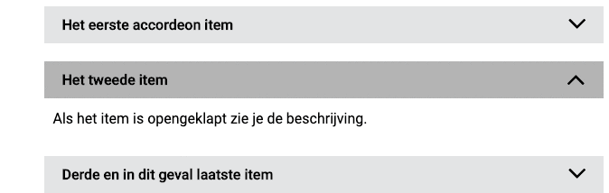

# Accordeon

Met een _accordeon_ kun je stukken tekst in-/uitklapbaar maken, om ruimte te besparen op de pagina.

Wil je uitgebreidere content kunnen in- en uitklappen? Doe dit dan door een _Toggle_ toe te voegen aan een _Column_ widget. \[TODO link toevoegen en engelse termen vervangen]

Een _accordeon_ wordt bijvoorbeeld vaak gebruikt voor ‘Veelgestelde vragen’-pagina’s.

## Configuratie-opties

### General

* Items: dit is een array \[TODO andere term]. Lees meer hier \[TODO].
  * Title
  * Description

### Styling

* Styles for the container: Deze module beschikt over de standaard CSS styling mogelijkheden, zie [styles for the container.](../miscellaneous/styles-for-the-container.md)
