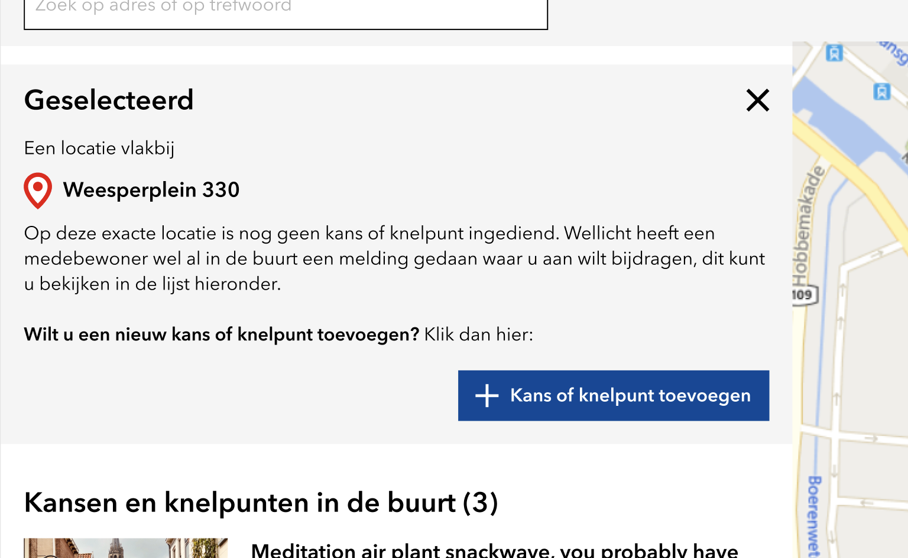

# Ideeën op een kaart (Kaart applicatie)

Zie de volgende how-to voor meer algemene informatie over het gebruik van deze widget:


[interactieve-kaart.md](../how-tos/interactieve-kaart.md)


## Widget settings


Na het aanpassen van de instellingen van deze widget moet je de pagina herladen om de widget met bijgewerkte instellingen te tonen.


### Algemeen

| Instelling                                        | Toelichting                                                                                                                                                                                                                                                                                                                                                                                                                                                                                                                                                                                       |
| ------------------------------------------------- | ------------------------------------------------------------------------------------------------------------------------------------------------------------------------------------------------------------------------------------------------------------------------------------------------------------------------------------------------------------------------------------------------------------------------------------------------------------------------------------------------------------------------------------------------------------------------------------------------- |
| Weergave                                          | Zet deze op _Volledig_. De optie _Simpel_ is voor toekomstig gebruik om de 'Ideas map'-widget (zie [idea-map.md](idea-map.md "mention")) te vervangen, maar momenteel nog niet volledig functioneel.                                                                                                                                                                                                                                                                                                                                                                                              |
| Naam voor ideas                                   | De waarde die je hier invult wordt gebruikt in de titel bovenaan de lijstweergave. Als je dit veld leeg laat, dan wordt "Inzendingen" gebruikt: "Inzendingen in dit gebied (xx)"                                                                                                                                                                                                                                                                                                                                                                                                                  |
| Veld voor type inzending                          | Hiermee kies je op basis van welke groep je op de kaart een onderscheid wil kunnen maken. Binnen die groep kun je visueel onderscheid maken met verschillende iconen (zie [interactieve-kaart-thema-iconen.md](../miscellaneous/interactieve-kaart-thema-iconen.md "mention")), en de filter functionaliteit werkt op basis van deze groep. Het is het gemakkelijkst om hier voor _Thema_ te kiezen. Voor meer geavanceerde websites kun je kiezen voor _Idee type_. Zowel thema's als idee types moeten gedefinieerd worden in _Global_ (zie [global.md](../miscellaneous/global.md "mention")). |
| Label voor type in filters                        | Vul hier de tekst in die getoond moet worden in de filter dropdown bovenaan de kaart, als alle inzendingen getoond worden. Bijvoorbeeld "Alle inzendingen".                                                                                                                                                                                                                                                                                                                                                                                                                                       |
| Op mobiel opent de lijst van ideeën over de kaart | Op mobiele apparaten wordt óf de kaart óf de lijstweergave getoond. Standaard wordt bij het openen van de pagina eerst de kaart getoond. Met deze instelling kun je kiezen om eerst de lijstweergave te tonen.                                                                                                                                                                                                                                                                                                                                                                                    |

### Kaart

Onderstaande instellingen hebben betrekking op de kaart zelf.

| Instelling                                 | Toelichting                                                                                                                                                                                                                                                                                                                                                                                                                                                                                                                                                    |
| ------------------------------------------ | -------------------------------------------------------------------------------------------------------------------------------------------------------------------------------------------------------------------------------------------------------------------------------------------------------------------------------------------------------------------------------------------------------------------------------------------------------------------------------------------------------------------------------------------------------------- |
| Variant                                    | Hiermee kies je de kaart 'achtergrond', of eigenlijk uit welke bron de tegels waaruit de kaart opgebouwd is moeten worden opgehaald. _NLMaps_ werkt voor alle gemeenten in Nederland. Voor Amsterdam is het volgens huisstijl verplicht om _Amsterdam_ te gebruiken. Met de optie _Geavanceerd_ kun je handmatig een andere 'tiles server' instellen.                                                                                                                                                                                                          |
| Url van de tiles server                    | Alleen zichtbaar als je hierboven bij _Variant_ voor _Geavanceerd_ kiest. Gebruik dit veld om handmatig een andere 'tiles server' in te stellen.                                                                                                                                                                                                                                                                                                                                                                                                               |
| Subdomains van de tiles server             | Alleen zichtbaar als je hierboven bij _Variant_ voor _Geavanceerd_ kiest. Gebruik dit veld om handmatig een andere 'tiles server' in te stellen.                                                                                                                                                                                                                                                                                                                                                                                                               |
| Zoom en center op                          | Kies hoe de kaart getoond moet worden (zoomniveau en middelpunt) als de pagina geladen wordt. Kies voor _Polygon_ als je het totale begrensde gebied wil tonen. Hiervoor moet een polygon ingesteld zijn (zie [polygonen.md](../how-tos/polygonen.md "mention")). Kies voor _Markers_ om op inzendingen op de kaart te focussen. Als er geen inzendingen getoond worden, wordt teruggevallen op de polygon. Als er geen polygon ingesteld is, wordt teruggevallen op de map-instellingen van _Global_ (zie [global.md](../miscellaneous/global.md "mention")). |
| Default Location icon                      | Als een locatie op de kaart geselecteerd wordt (niet een inzending), dan wordt er op die locatie een icoon getoond. Met deze instelling kun je handmatig een ander icoon kiezen. Hoe dit werkt lees je in [interactieve-kaart-thema-iconen.md](../miscellaneous/interactieve-kaart-thema-iconen.md "mention").                                                                                                                                                                                                                                                 |
| Gevoeligheid van clustering                | Afhankelijk van het zoomniveau van de kaart, kunnen inzendingen dicht bij elkaar komen te liggen. Als deze te dicht bij elkaar komen, dan worden inzendingen geclusterd in één cirkel-icoon met het cijfer met het aantal geclusterde inzendingen. Door de waarde van deze instelling aan te passen bepaal je hoe snel dit moet gebeuren.                                                                                                                                                                                                                      |
| Op de kaart klikken selecteert een locatie | Kies of het mogelijk is om een locatie te selecteren door op de kaart te klikken. Voor meer informatie over verschillende weergaves, zie [#verschillende-weergaves](../how-tos/interactieve-kaart.md#verschillende-weergaves "mention")                                                                                                                                                                                                                                                                                                                        |
| Op een kaart klikken                       | Kies wat er gebeurt als je op een inzending op de kaart klikt. De optie _Selecteert een idee_ laat de 'Punt geselecteerd'-weergave zien zoals beschreven in [#verschillende-weergaves](../how-tos/interactieve-kaart.md#verschillende-weergaves "mention"). De optie _Toon idee details_ opent direct de detailweergave.                                                                                                                                                                                                                                       |

### Content

Deze sectie van de instellingen gaat over de invulling van het selectievlak (bovenste deel van het contentvlak, met grijze achtergrond) in verschillende omstandigheden, zoals beschreven in [interactieve-kaart.md](../how-tos/interactieve-kaart.md "mention"). Er kan hiervoor gewoon tekst gebruikt worden, maar er is de mogelijkheid om meer styling toe te voegen door HTML en CSS te gebruiken.

In de toelichting hieronder wordt beschreven in welk geval welke content getoond wordt. Hier staat ook aangegeven of er aanvullende elementen gebruikt kunnen worden, bijvoorbeeld buttons, linkjes en adresgegevens.

De benoeming van de verschillende weergaves wordt in meer detail uitgelegd onder [#verschillende-weergaves](../how-tos/interactieve-kaart.md#verschillende-weergaves "mention").


In sommige gevallen kunnen er adresgegevens getoond worden van de geselecteerde locatie. Het is hiervoor belangrijk dat staat ingesteld in welke gemeente naar deze adresgegevens gezocht moet worden. Dit kun je instellen onder [#filterbalk](ideeen-op-een-kaart-kaart-applicatie.md#filterbalk "mention").


| Instelling                                                    | Toelichting                                                                                                                                                                                                                                                                                                                                                                                                                                                                                                                                |
| ------------------------------------------------------------- | ------------------------------------------------------------------------------------------------------------------------------------------------------------------------------------------------------------------------------------------------------------------------------------------------------------------------------------------------------------------------------------------------------------------------------------------------------------------------------------------------------------------------------------------ |
| <mark style="color:orange;">Link naar gebruikerspagina</mark> | <mark style="color:orange;">**Let op**</mark><mark style="color:orange;">: deze instelling staat mogelijk door een fout nog op deze plek, maar hoort eigenlijk onder</mark> [#idee-details](ideeen-op-een-kaart-kaart-applicatie.md#idee-details "mention")<mark style="color:orange;">. Kijk daar voor meer info.</mark>                                                                                                                                                                                                                  |
| noSelectionLoggedInHTML                                       | 
<strong>Weergave</strong>: Niets geselecteerd <strong>Gebruiker is ingelogd</strong>: Ja <strong>Optionele elementen</strong>: Je kunt <code>{addButton}</code> gebruiken om gebruikers naar het indienformulier te leiden, maar er is nog geen locatie geselecteerd. Dat moet nog gebeuren terwijl het formulier getoond wordt, maar de interface is hier nog niet voor geoptimaliseerd. Het is beter om deze knop te tonen als er wel een locatie geselecteerd is, zie de instelling <em>selectionActiveLoggedInHTML</em>. 
 |
| noSelectionNotLoggedInHTML                                    | 
<strong>Weergave</strong>: Niets geselecteerd <strong>Gebruiker is ingelogd</strong>: Nee <strong>Optionele elementen</strong>: Je kunt <code>{loginButton}</code> gebruiken om een inlog-knop te tonen.
                                                                                                                                                                                                                                                                                                                      |
| noSelectionHTML                                               | **Let op**: deze instelling is verouderd. Dit invoerveld is verouderd en wordt in de toekomst helemaal vervangen door _noSelectionLoggedInHTML_ en _noSelectionNotLoggedInHTML_. Gebruik deze twee invoervelden, als deze nieuwe invoervelden in gebruik zijn, dan wordt dit verouderde invoerveld overschreven.                                                                                                                                                                                                                           |
| Toon het noSelection blok op mobiel                           | Kies of _noSelectionLoggedInHTML_ en _noSelectionNotLoggedInHTML_ ook op kleinere schermen getoond moet worden.                                                                                                                                                                                                                                                                                                                                                                                                                            |
| selectionActiveLoggedInHTML                                   | 
<strong>Weergave</strong>: (Nieuw) punt geselecteerd <strong>Gebruiker is ingelogd</strong>: Ja <strong>Optionele elementen</strong>: Gebruik <code>{address}</code> om het geselecteerde adres te tonen, en gebruik <code>{addButton}</code> om een knop te tonen die naar het indienformulier leidt.
                                                                                                                                                                                                                        |
| selectionInactiveLoggedInHTML                                 | 
<strong>Weergave</strong>: (Nieuw) punt geselecteerd, maar buiten het <a href="../how-tos/polygonen.md">begrensde gebied</a>. <strong>Gebruiker is ingelogd</strong>: Ja <strong>Optionele elementen</strong>: Gebruik <code>{address}</code> om het geselecteerde adres te tonen.
                                                                                                                                                                                                                                            |
| mobilePreviewLoggedInHTML                                     | 
<strong>Weergave</strong>: (Nieuw) punt geselecteerd, in de preview die op kleine schermen getoond wordt.  <strong>Gebruiker is ingelogd</strong>: Ja <strong>Optionele elementen</strong>: Gebruik <code>{address}</code> om het geselecteerde adres te tonen.
                                                                                                                                                                                                                                                               |
| selectionActiveNotLoggedInHTML                                | 
<strong>Weergave</strong>: (Nieuw) punt geselecteerd <strong>Gebruiker is ingelogd</strong>: Nee <strong>Optionele elementen</strong>: Gebruik <code>{address}</code> om het geselecteerde adres te tonen en gebruik <code>{loginButton}</code> om een inlog-knop of <code>{loginLink}</code> om een inlog-link te tonen. Bij die laatste wil je waarschijnlijk wat aanvullende HTML gebruiken, bijvoorbeeld <code>&#x3C;a href="{loginLink}">Klik hier om in te loggen&#x3C;/a></code>.
                                      |
| selectionInactiveNotLoggedInHTML                              | 
<strong>Weergave</strong>: (Nieuw) punt geselecteerd, maar buiten het <a href="../how-tos/polygonen.md">begrensde gebied</a>. <strong>Gebruiker is ingelogd</strong>: Nee <strong>Optionele elementen</strong>: Gebruik <code>{address}</code> om het geselecteerde adres te tonen.
                                                                                                                                                                                                                                           |
| mobilePreviewNotLoggedInHTML                                  | 
<strong>Weergave</strong>: (Nieuw) punt geselecteerd, in de preview die op kleine schermen getoond wordt.  <strong>Gebruiker is ingelogd</strong>: Nee <strong>Optionele elementen</strong>: Gebruik <code>{address}</code> om het geselecteerde adres te tonen.
                                                                                                                                                                                                                                                              |

Als er een inzending op de kaart geselecteerd is, dan toont het selectievlak altijd een tegel van de geselecteerde inzending, tenzij is ingesteld dat direct de detailweergave getoond moet worden.

### Sorteren

In de 'Niets geselecteerd'-weergave (zie [interactieve-kaart.md](../how-tos/interactieve-kaart.md "mention")) kan er bovenaan de lijstweergave een dropdown getoond worden met verschillende mogelijkheden om de lijst te sorteren. De instellingen in deze sectie gaan hierover.

| Instelling                 | Toelichting                                                                                                               |
| -------------------------- | ------------------------------------------------------------------------------------------------------------------------- |
| Select sorting available   | Kies welke sorteermogelijkheden je beschikbaar wil maken. Kies er minimaal twee, anders kun je beter niets selecteren.    |
| Select the default sorting | Kies welke sorteren er standaard gebruikt wordt. Zorg dat je deze ook hierboven bij _Select sorting available_ aanvinkt.  |

### Idee afbeeldingen

Onderstaande instellingen gaan over de afbeelding(en) die bij inzendingen horen.

| Instelling                         | Toelichting                                                                                                                      |
| ---------------------------------- | -------------------------------------------------------------------------------------------------------------------------------- |
| Meerdere afbeeldingen bij een idee | Geef aan of de inzendingen op de kaart meerdere afbeeldingen (kunnen) hebben.                                                    |
| Aspect ratio                       | Kies de verhouding waarin de afbeeldingen getoond worden. _16:9_ is een standaard 'breedbeeld' verhouding, en _1:1_ is vierkant. |
| Default afbeelding                 | Hier kun je een afbeelding uploaden die getoond wordt bij een inzending, als de inzending zelf geen specifieke afbeelding heeft. |

### Idee details

Onderstaande instellingen hebben betrekking op de _detailweergave_ van de interactieve kaart, zoals beschreven in [#verschillende-weergaves](../how-tos/interactieve-kaart.md#verschillende-weergaves "mention").

| Instelling                                                                                      | Toelichting                                                                                                                                                                                                                                                                                                                                                                                                                                                                                                                       |
| ----------------------------------------------------------------------------------------------- | --------------------------------------------------------------------------------------------------------------------------------------------------------------------------------------------------------------------------------------------------------------------------------------------------------------------------------------------------------------------------------------------------------------------------------------------------------------------------------------------------------------------------------- |
| Metadata regel template                                                                         | 
Pas hier de regel aan die in de detailweergave boven de samenvatting van een inzending getoond wordt. Je kunt hier HTML en CSS voor gebruiken.  De volgende variabelen zijn beschikbaar: - <code>{username}</code> : gebruikersnaam van de indiener van de inzending - <code>{createDate}</code> : datum en tijd waarop de inzending aangemaakt is - <code>{theme}</code> : thema van de instelling
                                                                                                         |
| Link naar gebruikerspagina                                                                      | 
<strong>Let op: deze instelling staat mogelijk door een fout nog onder</strong> <a data-mention href="ideeen-op-een-kaart-kaart-applicatie.md#content">#content</a>. Als je in de metadata regel de gebruikersnaam van een inzending toont, dan kun je die met deze instelling aanklikbaar maken. Tip: gebruik een relatieve URL, bijvoorbeeld <code>/gebruikers</code>. Achter deze URL wordt automatisch het user-id van de auteur van de inzending geplakt, dat wordt dan bijvoorbeeld <code>/gebruikers/110</code>.
 |
| Display share buttons?                                                                          | Kies of er knoppen getoond worden om de huidige inzending te delen via bijvoorbeeld social media of e-mail.                                                                                                                                                                                                                                                                                                                                                                                                                       |
| Select which share buttons you want to display (if left empty all social buttons will be shown) | Specificeer welke knoppen er getoond worden. Als je niets selecteert, dan worden alle knoppen getoond.                                                                                                                                                                                                                                                                                                                                                                                                                            |

### Filterbalk

Onderstaande instellingen hebben betrekking op de zoek- en filterbalk.

| Instelling                                  | Toelichting                                                                                                                                                                                                                                                                                                                                                                                                          |
| ------------------------------------------- | -------------------------------------------------------------------------------------------------------------------------------------------------------------------------------------------------------------------------------------------------------------------------------------------------------------------------------------------------------------------------------------------------------------------- |
| Waar wordt in gezocht                       | Je kunt kiezen of er gezocht wordt in de titels van inzendingen en/of naar adressen. Als je die laatste kiest, is het belangrijk om de instelling _Gemeente waarin naar adressen wordt gezocht_ in te vullen. Je kunt ook kiezen om het zoekveld te verbergen.                                                                                                                                                       |
| Placeholder tekst in het zoekveld           | Kies welke tekst er als placeholder in het zoekveld getoond wordt, als er door de gebruiker geen andere tekst ingevoerd is.                                                                                                                                                                                                                                                                                          |
| Gemeente waarin naar adressen wordt gezocht | 
Kies hier in welke gemeente er naar adressen gezocht kan worden. De naam van de gemeente die je hier invult dient overeen te komen met een naam uit <a href="https://nl.wikipedia.org/wiki/Lijst_van_Nederlandse_gemeenten">deze lijst van Nederlandse gemeenten op Wikipedia</a>.  Deze instelling wordt ook gebruikt om de adresgegevens op te halen als er op een locatie op de kaart geklikt wordt.
 |

### Reacties

Onderstaande instellingen hebben betrekking op de reacties die (optioneel) onder de inhoud van een inzending in de detailweergave getoond worden.

| Instelling                                       | Toelichting                                                                                                                                                                                                                                                                                                                                                                                          |
| ------------------------------------------------ | ---------------------------------------------------------------------------------------------------------------------------------------------------------------------------------------------------------------------------------------------------------------------------------------------------------------------------------------------------------------------------------------------------- |
| Toon reacties                                    | Kies of er reacties getoond moeten worden onderaan de detailweergave.                                                                                                                                                                                                                                                                                                                                |
| Titel boven reacties                             | Pas de tekst van de titel aan die boven de reacties getoond wordt.                                                                                                                                                                                                                                                                                                                                   |
| Tekst in leeg reactie invoerveld                 | Voer de placeholdertekst in dat getoond wordt als het reactieveld nog leeg is.                                                                                                                                                                                                                                                                                                                       |
| Tekst boven reactie invoerveld                   | Kies welke tekst er getoond wordt boven het reactie invoerveld.                                                                                                                                                                                                                                                                                                                                      |
| Ids van Ideas waarvoor reacties niet actief zijn | Hier kun je specificeren voor welke inzendingen er geen reacties getoond moeten worden. Dit doe je door de _id_'s van deze inzendingen in te voeren, gescheiden door een komma. Bijvoorbeeld: `1256,1257,1259`. Hierdoor worden eventuele bestaande reacties verborgen. Wil je bestaande reacties wel tonen, maar de mogelijkheid om nieuwe reacties toe te voegen uitschakelen? Kijk dan hieronder. |
| Reactiemogelijkheid is...                        | Kies of de reactiemogelijkheid voor alle inzendingen open is, voor alle inzendingen gesloten, of slechts voor bepaalde inzendingen gesloten. Bij de laatste optie is het belangrijk dat je de instelling _Ids van Ideas waarvoor reacties gesloten zijn_ invult.                                                                                                                                     |
| Tekst boven gesloten reacties blok               | Voer de tekst in die boven de reacties getoond moet worden, als de optie om te reageren uitgeschakeld is.                                                                                                                                                                                                                                                                                            |
| Ids van Ideas waarvoor reacties gesloten zijn    | Vul hier in voor welke specifieke inzendingen de reactiemogelijkheid gesloten is. Dit doe je door de _id_'s van deze inzendingen in te voeren, gescheiden door een komma. Bijvoorbeeld: `1256,1257,1259`.                                                                                                                                                                                            |

### Idee formulier

| Instelling  | Toelichting                                                                                                                                                                                                                                                                                                                                                                                       |
| ----------- | ------------------------------------------------------------------------------------------------------------------------------------------------------------------------------------------------------------------------------------------------------------------------------------------------------------------------------------------------------------------------------------------------- |
| Form Url    | 
De widget heeft een geïntegreerd formulier. Wil je deze liever niet gebruiken? Vul hier dan de (relatieve) URL in van de pagina met een ander formulier (waarschijnlijk een <a data-mention href="resource-form.md">resource-form.md</a>).  Hiermee worden de instellingen bij <em>Form fields</em> (hieronder) niet gebruikt.
                                                       |
| Form fields | 
Hiermee kun je het geïntegreerde formulier configureren. Zie hieronder de toelichting bij het instellen van de <em>Form fields</em>. Als je deze instelling leeg laat, dan wordt er een standaard formulier getoond. <em></em> <em></em><strong>Let op</strong>: Als er hierboven bij <em>Form Url</em> een waarde ingevuld is, dan wordt het geïntegreerde formulier niet gebruikt.
 |

#### Form fields

Toelichting op de instellingen van _Form fields._


Laat _Form fields_ leeg om een standaard formulier te tonen.



Als je handmatig het formulier instelt, is het belangrijk dat je op zijn minst de volgende velden aanmaakt:

* title
* summary
* description


| Instelling                                    | Toelichting                                                                                                                                                                                                                                                        |
| --------------------------------------------- | ------------------------------------------------------------------------------------------------------------------------------------------------------------------------------------------------------------------------------------------------------------------ |
| Name of the database field                    | Kies hier voor welk onderdeel van een inzending (of _idea_) je een veld in het formulier wil aanmaken. Het is hierbij belangrijk dat je de juiste waarden in vult, zoals die vermeld staan in [database-velden.md](../miscellaneous/database-velden.md "mention"). |
| Title                                         | Geef een titel van het veld in het formulier.                                                                                                                                                                                                                      |
| Beschrijving                                  | Geef een toelichting bij het veld in het formulier.                                                                                                                                                                                                                |
| Type veld                                     | Kies wat voor een soort veld getoond moet worden.                                                                                                                                                                                                                  |
| Keuzes (enkel voor multiple choice of select) | Geef hier aan welke keuzemogelijkheden er voor dit veld zijn. Dit is niet bij elk veld van toepassing.                                                                                                                                                             |
| Is verplicht                                  | Geef aan of dit veld in het formulier verplicht ingevuld moet worden.                                                                                                                                                                                              |

### Info

| Instelling               | Toelichting                                                                                |
| ------------------------ | ------------------------------------------------------------------------------------------ |
| Styles for the container | Zie [styles-for-the-container.md](../miscellaneous/styles-for-the-container.md "mention"). |
